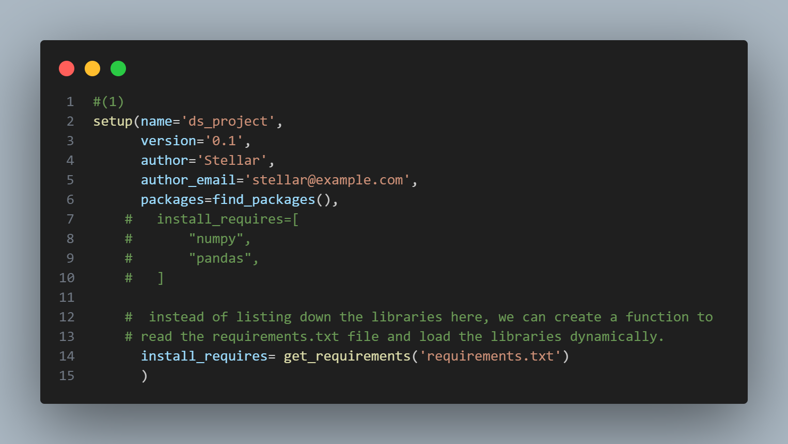
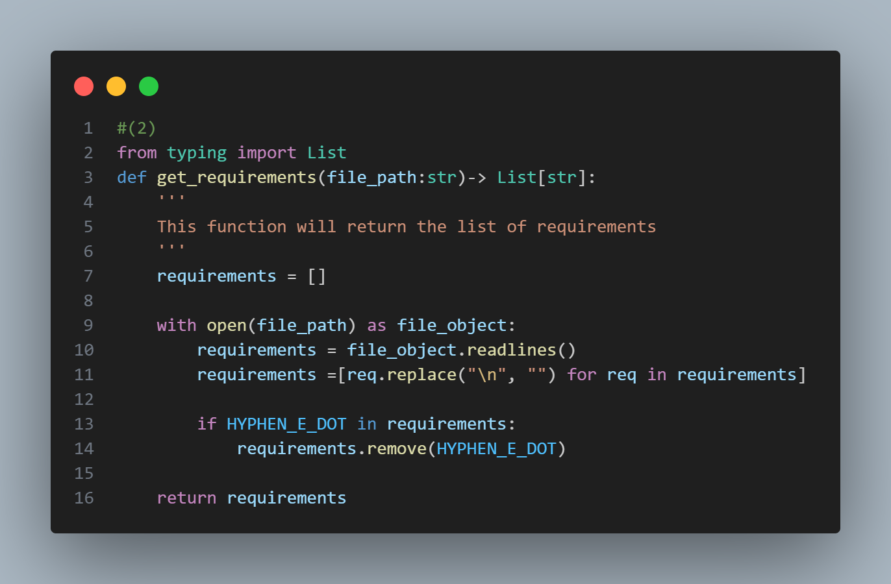

### Step 1: Create a Setup Script

#### (1) Setup Script
Create a `setup.py` file , this file will define your package and its dependencies. this allows you to easily install your package and its dependencies using pip.

**official documentation:** [Setup Tools](https://setuptools.pypa.io/en/latest/)





In this we will have to pass the `install_requires` parameter to the `setup()` function.    But instead of manually listing down the libraries here, we can create a function to read the `requirements.txt` file and load the libraries dynamically.
So we can create a function called `get_requirements()` that will read the `requirements.txt` file and return a list of libraries.

#### (2) `get_requirements` Function



We take the file path as an input and return a list of libraries.  

we read the file line by line and add each line to the list of requirements. We also remove any whitespace characters from the beginning and end of each line.


#### (3) Create src folder

Next, we need to create a `src` folder. This folder will contain all of our source code. To create the folder, we can use the following command:

```bash
mkdir src
```


#### (4) Create `__init__.py`

Finally, we need to create an `__init__.py` file inside the `src` folder. This file will make Python treat the `src` folder as a package. To create the file, we can use the following command:

```bash
touch src/__init__.py
```

#### (5) Run the Setup Script

Now that we have our `setup.py` file and our `src` folder, we can run the setup script to install our package. To do this, we can use the following command:

```bash
pip install -e .
```

or 

```bash
python setup.py install
```
