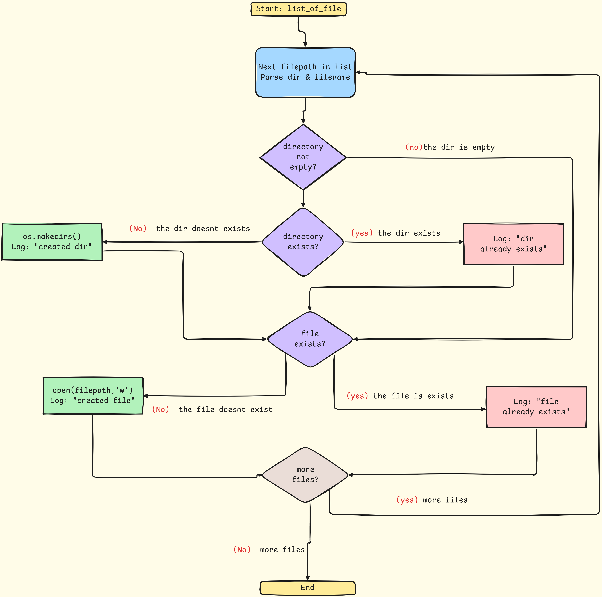
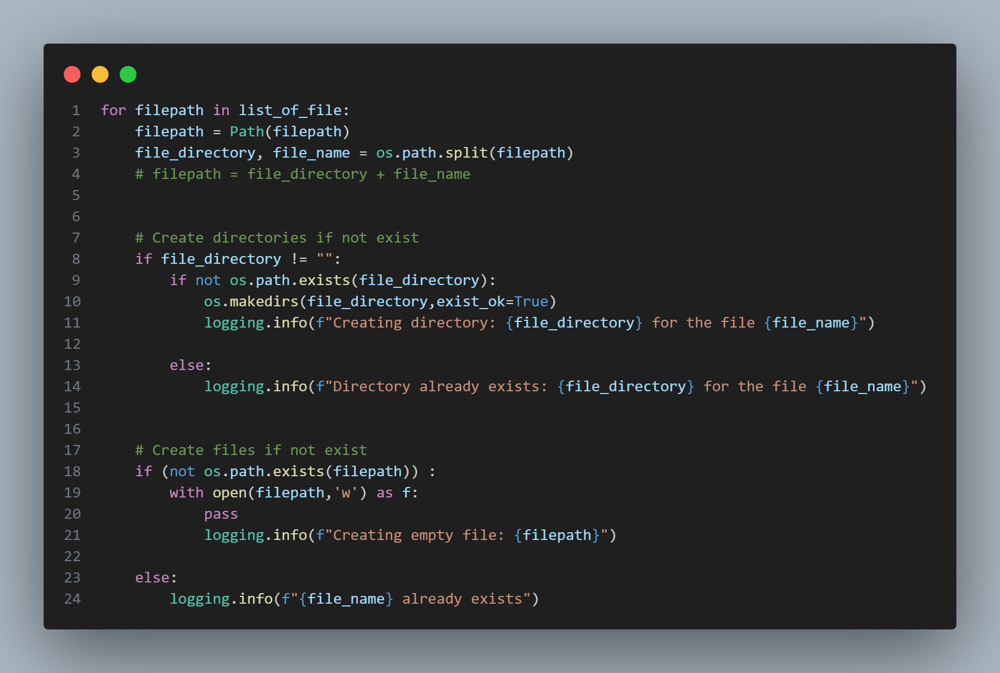

### Commit 2: Automated Project Directory Creation

#### (1) template.py
we will create a script that automates the creation of the project directory structure and necessary files for a new data science project.

The script will create the following directory structure:

```
.
├── .github
│   └── workflows
│       └── .gitkeep
├── src
│   └── dsproject
│       ├── __init__.py
│       ├── components
│       │   ├── __init__.py
│       │   ├── data_ingestion.py
│       │   ├── data_transformation.py
│       │   ├── model_trainer.py
│       │   └── model_monitoring.py
│       └── pipelines
│           ├── __init__.py
│           ├── training_pipeline.py
│           └── prediction_pipeline.py
├── app.py
├── Dockerfile
├── requirements.txt
└── setup.py
```
we can create a function called `create_project_structure()` that will create the necessary directories and files for our project.

We can also add/create new files and directories as needed by updating the `list_of_file` in the `create_project_dir` function.

#### (2) Create `create_project_dir()` function
we define a variable `list_of_file` that contains all the files and directories to be created. Then, we iterate over this list and create the necessary directories and files using the `os` and `pathlib` libraries.

#### (3) Directory Automation Logic
To automate the directory creation process, we can use the `os.makedirs()` function, which will create all the intermediate directories if they do not exist. This will simplify our code and make it more robust.

To automate the file creation process, we can use the `open()` function in Python, which allows us to create a new file or open an existing file for reading or writing. By using the `with` statement, we can ensure that the file is properly closed after we are done with it.




